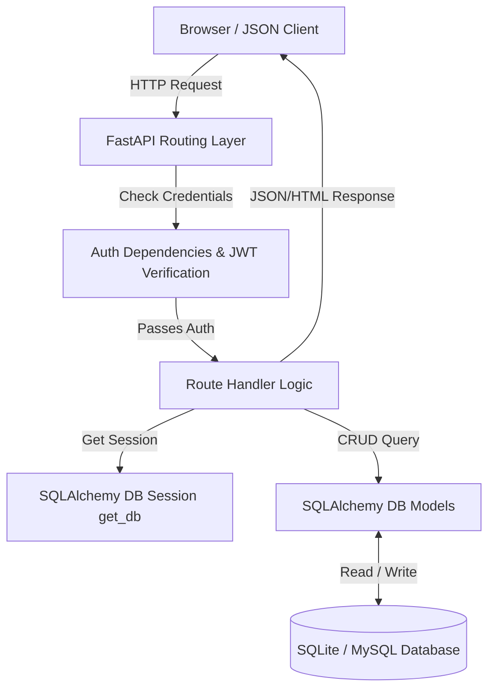
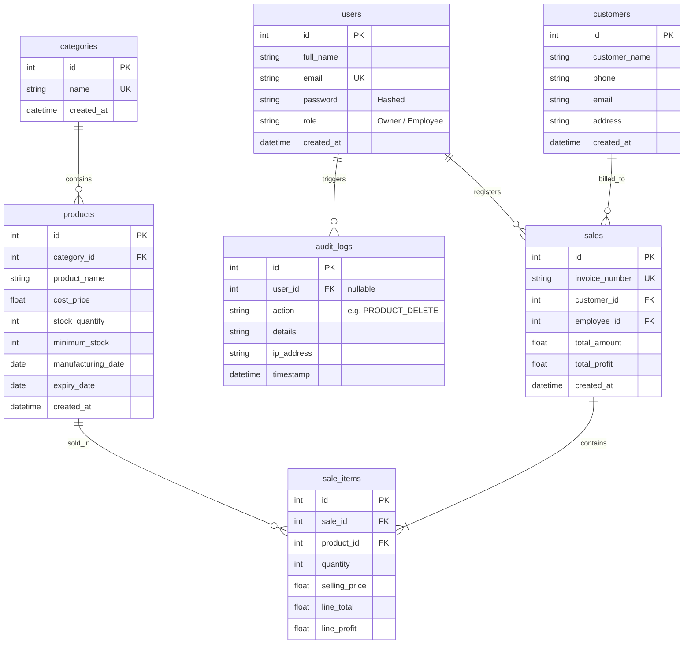

# StockMate - Inventory & Sales Management System

[](https://fastapi.tiangolo.com)
[](https://www.sqlalchemy.org/)
[](https://getbootstrap.com)
[](https://docs.pytest.org/)

StockMate is a premium, transaction-safe inventory and sales billing application built using **FastAPI**, **SQLAlchemy ORM**, **Pydantic validation**, and a custom dark glassmorphic interface powered by **Bootstrap 5**. Designed specifically for retail and wholesale business management, the application enforces rigorous security boundaries, tracks comprehensive audit logs, computes real-time analytical aggregates, and guarantees transactional stock consistency under concurrent loads.

---

## 🌟 Key Features

### 1. Advanced Inventory Control
- **Low Stock Warnings**: Computes warnings dynamically when a product's stock levels fall below its predefined minimum threshold.
- **Product Expiry Alerts**: Automatically flags products as "Expired" or "Expiring Soon" (within 30 days) to prevent waste.
- **Hierarchical Categorization**: Supports nested product relationships with cascading cleanup options.

### 2. Transaction-Safe Invoicing
- **Sequential Invoices**: Formats unique invoice numbers (e.g. `INV-000001`) sequentially.
- **Concurrence & Safety**: Leverages SQLAlchemy database row-level locking via `.with_for_update()` to prevent double-billing race conditions during multi-item checkout processes.
- **Atomic Rollbacks**: Guarantees that if any item in a multi-product order fails inventory verification, the entire invoice transaction is cleanly rolled back.

### 3. Business Analytics & Reporting
- **Interactive Charts**: Render daily sales volume, monthly revenue, top-selling items, and category ratios using Chart.js.
- **Custom Presets**: Filter aggregated profits and sales count by preset intervals (Today, Yesterday, Last 7 Days, Month, Year, or Custom range).
- **PDF & CSV Exporting**: Stream printable PDF invoice sheets dynamically via ReportLab and download raw products, customers, and sales data as CSV streams.

### 4. Security & Audit Trail
- **Role-Based Routing**: Restricts administrative dashboards, user registers, and audit trails to the `Owner` role, while granting checkout access to `Employee` credentials.
- **Security Audit Logs**: Silently records critical changes (creations, modifications, deletions, authentication events) across database sub-transactions. Logs include IP tracking, timestamps, and initiating user IDs.
- **Self-Deletion Lock**: Restricts administrative accounts from deleting themselves.

---

## 🏗️ System Architecture

### Component Flow Diagram
The following diagram illustrates how HTTP requests flow through the application's clean, layered architecture:



### Database Entity-Relationship Diagram (ERD)
The database structure consists of seven fully relational tables:



---

## 📂 Project Structure

```text
StockMate/
│
├── app/
│   ├── auth/              # JWT tokens, password hashing, and role checks
│   ├── models/            # SQLAlchemy Database schemas
│   ├── routers/           # API and HTML endpoints
│   ├── schemas/           # Pydantic schema validation structures
│   ├── static/            # CSS styles and front-end scripts
│   ├── templates/         # Jinja2 HTML views (Dashboards, CRUD Modals, Invoices)
│   ├── utils/             # Helpers (PDF drawers, CSV streams, logger)
│   ├── config.py          # Pydantic Settings management
│   ├── database.py        # SQLAlchemy engine and session configurations
│   └── main.py            # Application startup and global error handling
│
├── tests/                 # Automated Pytest suite
├── Procfile               # Cloud deployment process script
├── runtime.txt            # Python compiler version configuration
├── requirements.txt       # Project python dependencies package file
└── stockmate.db           # SQLite local developer database
```

---

## 🚀 Local Installation & Setup

### Prerequisites
- Python 3.9+ installed on your local machine.

### 1. Clone & Set Up Directory
Open your terminal in the workspace directory and execute:
```bash
# Create python virtual environment
python -m venv .venv

# Activate virtual environment
# On Windows (CMD/PowerShell):
.venv\Scripts\activate
# On macOS/Linux:
source .venv/bin/activate
```

### 2. Install Dependencies
Run the installation command (on Windows, `--only-binary=:all:` is recommended for a clean binary wheel install):
```bash
pip install -r app/requirements.txt --only-binary=:all:
```

### 3. Configure Environments
Create a `.env` file in your root folder:
```env
APP_ENV=development
SECRET_KEY=yoursecretkey123!@#
DATABASE_URL=sqlite:///./stockmate.db
```

### 4. Run Startup Migration & Seeding
Start the developmental Uvicorn server:
```bash
uvicorn app.main:app --port 8000
```
On application startup, FastAPI will automatically generate all relational tables and seed default credentials:
- **Owner Account**: `owner@stockmate.com` (password: `owner123`)
- **Employee Account**: `employee@stockmate.com` (password: `employee123`)

---

## 🧪 Running Automated Tests

The testing suite contains 9 test cases covering authentication cookies, CRUD boundary access restrictions, expiry property logic, customer registers, and transaction rollback checking. Run the tests via:
```bash
python -m pytest
```

---

## ☁️ Production Deployment (Railway)

StockMate is fully production-ready and configured for deployment on [Railway](https://railway.app):

1. **Procfile**: Tells Railway to spin up Uvicorn binding to `$PORT`:
   ```text
   web: uvicorn app.main:app --host 0.0.0.0 --port $PORT
   ```
2. **Environment Variables**: In the Railway dashboard settings, add:
   - `APP_ENV` = `production`
   - `SECRET_KEY` = `[RandomCryptographicString]`
   - `DATABASE_URL` = `[YourProductionDatabaseConnectionString]` *(Supports both SQLite disk mounts or MySQL databases)*

---

## 📖 Application Sections Guide

This section describes every screen and module available inside StockMate, from the perspective of each user role.

> **Legend**:  🔵 = Owner Only &nbsp;&nbsp; 🟢 = Both Roles

---

### 🔐 Login Page — `/auth/login`
🟢 **Accessible by: Owner & Employee**

The entry point of the application. Users provide their registered email and password. On successful authentication, a secure HTTP-only cookie session is created and the user is redirected to their role-specific dashboard.

- Invalid credentials show a flash error banner.
- Logout clears the session cookie and redirects back to the login screen.

---

### 🏠 Owner Dashboard — `/owner/dashboard`
🔵 **Accessible by: Owner only**

The owner's central command center, packed with live business intelligence:

| Widget | Description |
|--------|-------------|
| **Total Revenue** | Sum of all completed sale amounts across all time |
| **Today's Revenue** | Sum of today's invoices only |
| **Total Profit** | Net profit = selling price − cost price across all sales |
| **Today's Profit** | Net profit earned today |
| **Total Bills** | Count of all invoices ever processed |
| **Today's Bills** | Count of invoices raised today |
| **Low Stock Alerts** | Count of products whose stock has dropped below their minimum threshold |
| **Expiring Soon** | Count of products expiring within the next 30 days |

**Interactive Charts (Chart.js)**:
- 📊 **Daily Sales Bar Chart** — Volume of bills raised per day for the past 7 days.
- 📈 **Monthly Revenue Line Chart** — Revenue trend across the last 6 months.
- 🥧 **Top Products Doughnut** — Contribution of each product to total sales quantity.
- 🍩 **Category Revenue Doughnut** — Revenue distribution by product category.

---

### 👤 Employee Dashboard — `/employee/dashboard`
🟢 **Accessible by: Employee (Owner sees the Owner Dashboard instead)**

A focused, action-oriented screen showing only the information relevant to a counter employee:

| Widget | Description |
|--------|-------------|
| **Today's Sales (Personal)** | Total invoice revenue processed by this employee today |
| **Total Customers** | Count of all registered customers in the system |
| **Available Product Types** | Count of distinct products currently in the inventory catalog |

**Quick Action Buttons**:
- 🔍 Search Products & Inventory
- 👥 Register New Customer
- 🛒 Create Invoice / Sale

**Recent Invoices Table**: Shows the last 10 invoices processed by this employee with invoice number, customer name, date, and total.

---

### 📦 Products — `/products`
🟢 **Accessible by: Owner & Employee**

The full inventory catalog listing every product with real-time status indicators.

**Columns shown**:
- Product Name, Category, Cost Price, Selling Price, Stock Quantity, Minimum Stock, Manufacturing Date, Expiry Date

**Status Badges**:
- 🔴 **Expired** — Product's expiry date has passed.
- 🟠 **Expiring Soon** — Expires within 30 days.
- 🟡 **Low Stock** — Current stock is below the minimum threshold.
- 🟢 **In Stock** — All good.

**Owner-only controls**:
- ➕ Add New Product (modal form with category, pricing, and date fields).
- ✏️ Edit Product (inline modal, pre-filled with existing values).
- 🗑️ Delete Product (with confirmation).

**Search & Filter**: Filter by name keyword, category, and stock status simultaneously.

---

### 🏷️ Categories — `/categories`
🟢 **Accessible by: Owner & Employee**

Manages the product classification system. All products must belong to a category.

**Table shows**: Category Name, Number of Products in that category, Date Created.

**Owner-only controls**:
- ➕ Add New Category (modal).
- ✏️ Edit Category Name (inline modal).
- 🗑️ Delete Category — Warns if products exist under that category before proceeding.

---

### 👥 Customers — `/customers`
🟢 **Accessible by: Owner & Employee**

The complete customer registry used when creating invoices.

**Table shows**: Customer Name, Phone, Email, Address, Registration Date, Number of Purchases.

**Controls (both roles)**:
- ➕ Register New Customer (modal with name, phone, email, address).
- ✏️ Edit Customer Details (inline modal).

**Owner-only controls**:
- 🗑️ Delete Customer (blocked if customer has existing invoices).

**Search**: Filter by customer name or phone number.

---

### 🏭 Suppliers — `/suppliers`
🟢 **Accessible by: Owner & Employee (read-only for Employees)**

The supplier/vendor directory used when creating purchase orders.

**Table shows**: Supplier Name, Contact Person, Phone, Email, Address, Date Registered.

**Owner-only controls**:
- ➕ Register Supplier (modal).
- ✏️ Edit Supplier Details.
- 🗑️ Delete Supplier.

Employees can view the supplier list but cannot add, edit, or delete records.

---

### 🛒 New Sale (Invoice Builder) — `/sales/create`
🟢 **Accessible by: Owner & Employee**

An interactive multi-item invoice builder — the primary point-of-sale screen.

**Workflow**:
1. Select a registered **Customer** from the dropdown.
2. Add products by choosing a product and entering quantity.
3. The form dynamically calculates **line totals** and **grand total** in real time.
4. Submit to finalize — stock is deducted atomically; a unique invoice number is assigned.

**Safety features**:
- Prevents selling more units than currently in stock.
- If any single item fails the stock check, the entire invoice is rolled back cleanly.
- Expired products are flagged with a warning.

---

### 📋 Sales History — `/sales`
🟢 **Accessible by: Owner & Employee**

A paginated, searchable ledger of all completed invoices.

**Columns**: Invoice #, Customer Name, Employee Name, Date/Time, Total Amount, Total Profit.

**Actions**:
- 🔍 **View Details** — Expands a modal showing every line item (product, quantity, unit price, subtotal).
- 📄 **Download PDF** — Streams a printable invoice PDF with company branding via ReportLab.

**Owner extras**: Sees all invoices from all employees. Can filter by employee name. Can also delete an invoice record.

**Employee view**: Sees only their own invoices by default (My Sales tab).

---

### 📦 Purchase Orders — `/purchases`
🟢 **Accessible by: Owner & Employee**

Tracks all inbound restocking orders placed with suppliers.

**Status Badges**:
- 🟡 **Pending** — Draft order submitted, awaiting Owner approval.
- 🟢 **Completed / Received** — Owner has approved; stock has been replenished.

**Table shows**: PO #, Supplier, Total Cost, Status, Created By, Date.

**Actions**:
- 🔍 **Details** — Modal showing each ordered product, quantity, and unit cost.
- ✅ **Approve** *(Owner only)* — Marks order as Completed, adds purchased quantities to product stock, and updates product cost price to the latest procurement cost.
- 🗑️ **Delete** *(Owner only)* — Removes a Pending draft.

---

### 🛍️ New Purchase Order — `/purchases/create`
🟢 **Accessible by: Owner & Employee**

An interactive procurement form for building a restocking draft.

**Workflow**:
1. Select a **Supplier** from the registered supplier list.
2. Add line items: choose a product, set quantity, and optionally override the unit cost.
3. The form shows a running total of the procurement cost.
4. Submit to save as a **Pending** draft — no stock is affected until an Owner approves.

---

### 📊 Reports & Analytics — `/reports`
🔵 **Accessible by: Owner only**

A dedicated analytical dashboard for business intelligence reporting.

**Date Filter Presets**: Today, Yesterday, Last 7 Days, This Month, This Year, Custom Range.

**Metrics shown**:
- Total Revenue, Total Profit, Total Bills, Average Bill Value for the selected period.
- Top 5 best-selling products by quantity.
- Revenue and profit breakdown by category.

**Export Options**:
- 📥 **Download Products CSV** — Full inventory catalog as a `.csv` file.
- 📥 **Download Customers CSV** — Complete customer registry as a `.csv` file.
- 📥 **Download Sales CSV** — All invoices with line-item detail as a `.csv` file.

---

### 👨‍💼 Employee Management — `/employees`
🔵 **Accessible by: Owner only**

Manage the staff accounts who operate the system.

**Table shows**: Full Name, Email, Role Badge, Date Created.

**Controls**:
- ➕ Add New Employee (modal — sets name, email, password, role).
- ✏️ Edit Employee (inline modal).
- 🗑️ Delete Employee — Owner cannot delete their own account (self-deletion lock).

---

### 📜 Audit Logs — `/audit-logs`
🔵 **Accessible by: Owner only**

A tamper-evident, chronological log of every significant action performed in the system.

**Columns**: Timestamp, User (who performed the action), Action Code, Details Description, IP Address.

**Action Codes include**:
`LOGIN`, `LOGOUT`, `PRODUCT_CREATE`, `PRODUCT_UPDATE`, `PRODUCT_DELETE`, `CATEGORY_CREATE`, `CATEGORY_DELETE`, `CUSTOMER_CREATE`, `CUSTOMER_UPDATE`, `CUSTOMER_DELETE`, `SALE_CREATE`, `SALE_DELETE`, `EMPLOYEE_CREATE`, `EMPLOYEE_UPDATE`, `EMPLOYEE_DELETE`, `PURCHASE_COMPLETE`, `SUPPLIER_CREATE`, `SUPPLIER_UPDATE`, `SUPPLIER_DELETE`

**Filters**: Filter by username or action type using dropdowns. Supports pagination for large log histories.

